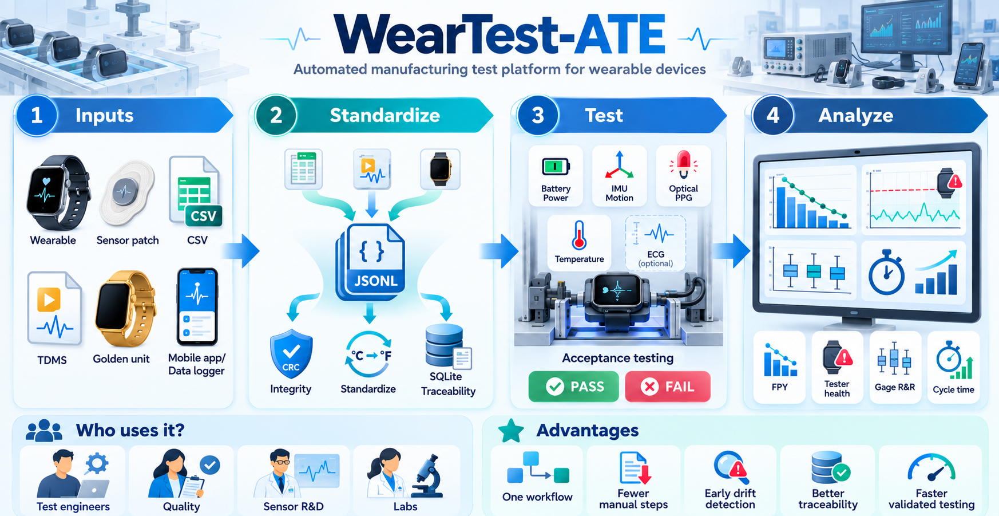

# WearTest-ATE

**WearTest-ATE** is a desktop automated test platform for wearable sensor devices. It brings device acceptance testing, acquisition-file import, production metrics, tester-health checks, measurement-system analysis, and cycle-time validation into one application.

The project was built as a practical manufacturing-test workflow rather than as a notebook demo. It can be used entirely with simulated data, or it can accept measurements exported from another acquisition system.

<p align="center">
  
</p>

## Why I built it

A production test system has to do more than return PASS or FAIL. Engineers also need to know whether the tester is healthy, whether measurements are repeatable across stations, why yield is changing, and whether a faster test sequence still catches the defects it is supposed to catch.

WearTest-ATE puts those questions into one workflow. The current project focuses on wearable health and fitness devices with battery/power, inertial sensing, optical PPG, skin-temperature, and optional ECG measurements.

All limits, reference values, station behavior, GR&R settings, and timing assumptions in this repository are project assumptions used for simulation and demonstration. They are not production specifications or factory data from a commercial device manufacturer.

## Who can use it

The current workflow is most useful as a starting point or demonstration platform for:

- manufacturing and automated test engineers
- quality and validation engineers
- sensor and wearable-device R&D teams
- laboratories that need repeatable sensor test workflows
- engineers working with CSV, NI TDMS, or LabVIEW-exported acquisition data

## What WearTest-ATE does

WearTest-ATE currently supports:

- configurable acceptance testing for battery/power, IMU, optical PPG, temperature, and optional ECG measurements
- single-product testing or one-click testing across all configured product profiles
- CSV and NI TDMS/LabVIEW import through a common adapter layer
- a standardized JSONL measurement representation for downstream processing
- unit normalization before measurements enter the test engine
- CRC32 checks, record-order validation, and recovery spooling for accidental data corruption or failed writes
- SQLite traceability for product tests, tester-health checks, GR&R studies, and cycle-time studies
- true first-pass yield, rolling FPY, failure Pareto, station performance, and recent test history
- golden-unit checks for tester bias and station drift
- batch golden-unit checks across all configured test stations
- crossed Gage R&R analysis for repeatability and reproducibility
- cycle-time comparison with defect-coverage validation before a faster sequence is accepted
- controlled fault injection and simulated production batches when hardware is not available

## How the pieces fit together

```text
Acquisition source
    |
    |-- Simulated wearable
    |-- CSV export
    |-- NI TDMS / LabVIEW
    |-- Custom adapter
    |
    v
Adapter + unit normalization
    |
    v
Standardized JSONL measurement records
    |
    |-- CRC32 integrity check
    |-- Sequence validation
    |-- Source metadata
    |-- Device, station, and session IDs
    |
    v
Reliable local storage
    |
    |-- Primary destination
    |-- Recovery spool if the primary write fails
    |
    v
Test and analysis engine
    |
    |-- Product PASS / FAIL
    |-- Failure codes
    |-- Golden-unit tester health
    |-- Gage R&R
    |-- Cycle-time validation
    |
    v
SQLite traceability + production dashboard
```

## Repository layout

```text
WearTest-ATE/
|
|-- run_app.py
|-- requirements.txt
|-- README.md
|-- LICENSE
|-- .gitignore
|
|-- assets/
|   `-- weartest_ate_graphical_abstract.png
|
|-- config/
|   |-- test_specs.ini
|   |-- products.ini
|   |-- golden_units.ini
|   |-- grr_study.ini
|   `-- cycle_time.ini
|
|-- examples/
|   |-- external_device_example.csv
|   `-- external_device_mapping.json
|
|-- weartest/
|   |-- app.py
|   |-- data.py
|   |-- adapters.py
|   |-- simulator.py
|   |-- test_engine.py
|   |-- storage.py
|   |-- grr.py
|   `-- cycle_time.py
|
|-- user_adapters/
|   `-- _example_adapter.py
|
`-- tests/
    `-- test_project.py
```

## Getting started

WearTest-ATE uses Python 3.10 or newer. An existing Anaconda environment works well.

From Anaconda Prompt:

```bash
conda activate YOUR_ENVIRONMENT
cd PATH_TO/WearTest-ATE
python -m pip install -r requirements.txt
```

To check which Python interpreter Spyder is using:

```python
import sys
print(sys.executable)
```

Open `run_app.py` in Spyder and run it with F5. The launcher adds the project root to the Python path, so the application does not depend on Spyder using a particular working directory.

You can also start the application from a terminal:

```bash
python run_app.py
```

## Main workspaces

### Run Device Test

This page runs the complete acceptance sequence for a selected product profile. Product definitions come from `config/products.ini`, so a new profile can be added without rewriting the GUI.

You can test one selected product or run every configured product profile as a batch. Each result is stored as its own traceable test session.

### External Data

This page imports measurements collected outside WearTest-ATE and sends them through the same test engine used for simulated devices.

The included example demonstrates unit conversion from common acquisition units such as:

| Measurement | Example source unit | Normalized unit |
|---|---:|---:|
| Battery voltage | mV | V |
| Acceleration | m/s² | g |
| Angular rate | rad/s | °/s |
| ECG impedance | Ω | kΩ |

The exact source-channel names and parser strings are defined in `examples/external_device_mapping.json`.

### Production

The production dashboard reads from the SQLite traceability database and summarizes what is happening across devices and stations.

It includes:

- unique devices tested
- true first-pass yield based on the first attempt for each device
- first-pass failures
- total sessions, including retests
- failure Pareto
- rolling 20-device FPY
- station-level performance
- latest tester-health state
- recent test sessions

The **Refresh dashboard** action re-queries SQLite and redraws the KPI cards, tables, Pareto chart, and FPY trend. It does not rely on a cached copy of the production data.

### Data Integrity

Every standardized measurement record carries a CRC32 checksum. WearTest-ATE recalculates that checksum when the record is read so accidental corruption can be detected before the measurement is trusted.

CRC32 is used here as an integrity check. It is not intended as a cryptographic authentication mechanism.

### Test Limits

Acceptance limits are read from `config/test_specs.ini`. They can be edited with a normal text editor and reloaded without changing Python source code.

### Tester Health

A production device answers the question, **"Is this product good?"** A golden unit answers a different question, **"Is this tester still measuring correctly?"**

A golden unit is a known-good reference device with expected measurements. WearTest-ATE runs that reference through a selected station, compares the measured values with the known values, and calculates tester bias.

Station health is reported as:

- **Healthy**
- **Warning**
- **Needs attention**

The simulation includes progressive station drift so this behavior can be exercised without physical ATE hardware. You can run one station at a time or check all configured stations in one batch.

### Measurement System

The Measurement System page runs a crossed Gage R&R study across multiple reference units, test stations, and repeated trials.

The analysis reports:

- repeatability
- station-to-station reproducibility
- part-by-station contribution
- total GR&R
- GR&R as a percentage of study variation
- part-to-part variation
- total study variation
- number of distinct categories, or ndc
- mean bias for each station

The default study uses 5 reference units, 3 stations, and 3 trials per station, giving 45 measurements.

### Cycle Time

This page compares a baseline sequence with faster candidate sequences. The goal is not simply to find the shortest test. A candidate is only accepted if it still meets the configured defect-detection and false-reject guardrails.

The application shortens the simulated acquisition windows, runs the same acceptance logic, and then compares the result against the baseline over a validation population.

Idealized throughput is calculated as:

```text
throughput = 3600 s/h ÷ estimated cycle time in s
```

This is a single-station estimate. It does not include operator handling, loading and unloading, maintenance, downtime, or line balancing.

### Simulation

The Simulation page makes it possible to exercise the application without hardware. It supports controlled fault injection and production-batch generation with visible progress and cancellation.

This is useful for testing the analysis workflow before connecting a real acquisition system.

## Standardized measurement records

After ingestion, a scalar measurement or waveform is represented by a `MeasurementRecord`. The record contains the measurement itself plus the metadata needed to trace where it came from.

Important fields include:

```text
device_id
station_id
session_id
sequence
measurement
unit
values
timestamp_utc
sample_rate_hz
test_step
source_format
source_name
quality_flags
record_id
checksum_crc32
```

Using one measurement contract means the acceptance engine does not need separate logic for CSV, TDMS, simulation, or each future data source.

## Bringing in another data format

`weartest/adapters.py` defines the adapter interface. A new converter only needs to read its source format and return standardized `MeasurementRecord` objects.

A template is included here:

```text
user_adapters/_example_adapter.py
```

Copy the template, remove the leading underscore from the filename, give the adapter a unique format name and extension, and implement its `convert()` method. User adapters are discovered when the application starts.

This keeps file-format details out of the manufacturing acceptance logic.

## Configuration files

| File | What it controls |
|---|---|
| `config/test_specs.ini` | Product acceptance limits for battery, IMU, optical sensing, temperature, and ECG impedance |
| `config/products.ini` | Available product configurations and whether ECG is required |
| `config/golden_units.ini` | Golden-unit references, tester-bias limits, warning thresholds, and simulated station drift |
| `config/grr_study.ini` | GR&R metric, number of reference units, repeated trials, decision bands, and repeatability assumptions |
| `config/cycle_time.ini` | Baseline and candidate sequences, timing assumptions, validation population, and quality guardrails |

## Example simulation results

These results come from the default project configuration and deterministic simulation seeds. They are included so the repository has reproducible examples, not as claims about a real production line.

### Golden-unit behavior

The intentionally stable station remains Healthy during repeated reference checks. The intentionally drifting station progresses from Healthy to Warning and then to Needs attention as its simulated measurement bias grows beyond the configured tester limit.

### Gage R&R

The default Accelerometer X study uses 5 reference units, 3 stations, and 3 repeated trials per station.

| Result | Value |
|---|---:|
| Measurements | 45 |
| GR&R | 19.3% |
| Repeatability, σ | 0.00265 g |
| Reproducibility, σ | 0.00569 g |
| Part-to-part variation, σ | 0.03193 g |
| ndc | 7 |
| Assessment | Review |

The simulated measurement system is intentionally not perfect. That gives the analysis enough station-to-station and repeated-measurement variation to diagnose.

### Cycle-time validation

| Strategy | Estimated cycle time | Result |
|---|---:|---|
| Baseline sequential | 23.3 s | Baseline |
| Parallel acquisition | 17.3 s | Validated |
| Balanced | 12.3 s | Validated |
| Aggressive | 7.3 s | Validated |
| Too short | 6.3 s | Rejected |

The 7.3 s candidate retains 100% simulated defect detection in the configured validation population and reduces modeled cycle time by about 68.7% relative to the 23.3 s baseline.

The 6.3 s candidate is faster, but it is rejected because simulated defect-detection retention falls to about 85.7% and the escaped-defect rate rises to 14.3%. The optimizer therefore favors the fastest **validated** sequence rather than the shortest sequence overall.

For reference, the idealized single-station throughput changes from about **155 units/h** at 23.3 s per device to about **493 units/h** at 7.3 s per device.

## Running the tests

From the project root:

```bash
python -m pytest -q
```

The regression suite covers the main engineering paths, including:

- CRC corruption detection
- unit conversion
- normal and faulty device acceptance
- external CSV import
- fallback storage
- TDMS import when `nptdms` is available
- first-pass yield and retest behavior
- rolling FPY
- golden-unit drift detection
- configurable product profiles
- crossed Gage R&R calculations and persistence
- cycle-time optimization and coverage loss

## Runtime data

The application creates a local `runtime/` directory while it is running. This contains the SQLite traceability database, normalized session files, and transport or recovery data.

`runtime/` is ignored by Git so local test history does not become part of the repository.

## A few design choices

**Why JSONL?**  
It is easy to inspect, stream, validate, and generate from common acquisition tools. The measurement contract is separate from the encoding, so a higher-throughput transport could replace JSONL later without changing the test logic.

**Why SQLite?**  
For a desktop portfolio application it provides structured traceability without requiring a database server. It is enough to demonstrate retests, station history, tester checks, GR&R studies, and optimization studies.

**Why INI files for limits and studies?**  
Test limits and study settings are engineering inputs. Keeping them outside Python makes the workflow easier to adjust and review.

**Why keep adapters separate from the test engine?**  
A CSV column name or TDMS channel path should not determine how acceptance logic is written. Adapters handle the source format, while the test engine works with normalized measurements.

**Why store UTC but display local time?**  
UTC keeps traceability timestamps unambiguous. Local display time is easier for an operator to read during a test session.

**Why use golden units?**  
When several products suddenly begin failing, the problem may be the products or the tester. A known-good reference gives the station a repeatable check and helps catch tester drift before it is mistaken for product failure.

## Current project boundaries

WearTest-ATE is an engineering demonstration, not a released factory test system or a medical-device validation package.

The current version has a few deliberate boundaries:

- measurements are simulated unless external acquisition data is imported
- acceptance limits and station drift are configurable project assumptions
- GR&R reference populations are simulated
- cycle-time values are modeled rather than measured on a physical line
- CRC32 protects against accidental corruption, not deliberate tampering
- hardware drivers, MES integration, operator authentication, calibration certificates, and regulated validation would be additional deployment work

## Technology

Python, Tkinter/ttk, NumPy, Pandas, Matplotlib, SQLite, npTDMS, and pytest.

## License

WearTest-ATE is released under the **MIT License**. See [`LICENSE`](LICENSE) for the full license text.

## Citation

If you use WearTest-ATE in academic work, teaching material, a technical report, or another public project, you can cite the repository as:

**Abraham, A. (2026). _WearTest-ATE: Automated manufacturing test platform for wearable sensor devices_ [Computer software]. GitHub. https://github.com/abhinz16/WearTest-ATE**

BibTeX:

```bibtex
@software{abraham2026weartestate,
  author  = {Abhinav Abraham},
  title   = {WearTest-ATE: Automated Manufacturing Test Platform for Wearable Sensor Devices},
  year    = {2026},
  url     = {https://github.com/abhinz16/WearTest-ATE},
  license = {MIT}
}
```
