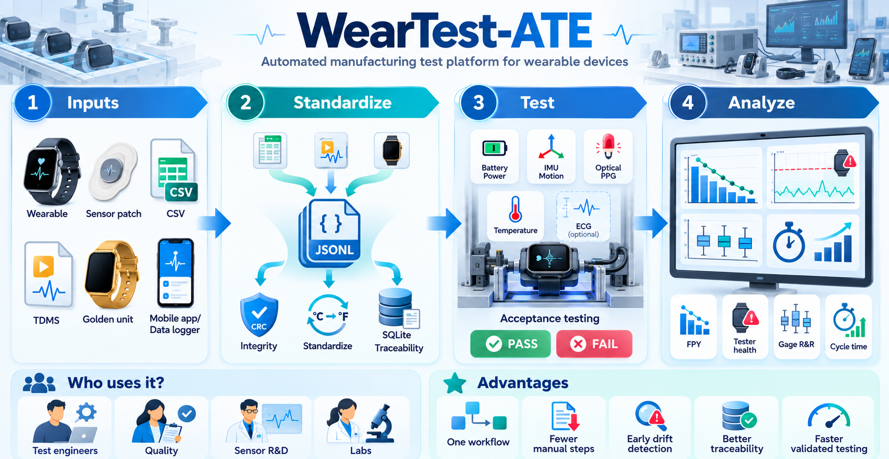

# WearTest-ATE

**WearTest-ATE** is a desktop automated test platform for wearable sensor devices. I built it to bring the parts of a manufacturing test workflow that are often handled separately into one place: device acceptance, external acquisition import, traceability, production metrics, tester-health checks, measurement-system analysis, and cycle-time validation.

The application can be used entirely in simulation, so the project does not require lab hardware to run. It can also accept measurements collected by another acquisition system and apply the same test logic to those records.

<p align="center">
  
</p>

## Why I built it

A useful production tester has to do more than return PASS or FAIL. If yield drops, an engineer needs to know what is failing. If several devices begin failing the same measurement, the test station itself may be drifting. If a test is shortened, the faster sequence still has to catch the defects that matter.

WearTest-ATE was built around those questions. The current version covers battery and power, IMU, optical PPG, red and infrared SpO₂ optical paths, skin temperature, BLE/RF, haptic vibration, and optional ECG impedance and waveform verification.

All limits, reference values, station behavior, Gage R&R settings, fault models, and timing values in this repository are project assumptions. They are not production specifications or factory data from a commercial wearable manufacturer.

## Who can use it

The project is intended as a starting point or demonstration platform for manufacturing and automated test engineers, quality and validation engineers, sensor and wearable-device R&D teams, and laboratories that need a repeatable way to bring sensor measurements into a common test workflow.

It is also useful when the acquisition already exists in another tool. WearTest-ATE can ingest CSV and NI TDMS/LabVIEW data, and the adapter interface can be extended for another file format or data source without rewriting the acceptance engine.

## What the current version tests

| Test area | Input used by WearTest-ATE | What is checked |
|---|---|---|
| Battery | Battery voltage in V | Configured voltage range |
| Charging and power | Charging, idle, and active current in mA | Charging-current range and operating-current limits |
| Accelerometer | X, Y, and Z waveforms in g | Bias and RMS noise |
| Gyroscope | X, Y, and Z waveforms in °/s | Bias and RMS noise |
| Optical PPG | PPG optical waveform | Fixture response, SNR, and saturation |
| SpO₂ optical path | Red and infrared optical waveforms | Red/IR SNR, amplitude ratio, and saturation |
| Skin temperature | Temperature in °C | Error from the configured reference |
| BLE/RF | TX power in dBm, packet error rate in %, frequency error in kHz | Functional RF limits |
| Haptic motor | Vibration waveform in g | RMS vibration level and dominant frequency in Hz |
| ECG electrode path | Electrode impedance in kΩ | Maximum impedance |
| ECG waveform | Injected ECG waveform in mV | Amplitude, reference-waveform correlation, and residual RMS noise |

The SpO₂ function is an **optical-path verification**, not a clinical blood-oxygen validation. It checks whether the red and infrared sensing paths respond correctly to a controlled optical fixture. The ECG waveform test is also a bench verification: the software compares the measured response with a known injected reference waveform.

## What else the software does

Beyond the individual device checks, WearTest-ATE provides:

- single-product testing and one-click testing across all configured product profiles
- CSV and NI TDMS/LabVIEW ingestion through a common adapter layer
- standardized JSONL measurement records for downstream processing
- unit normalization before measurements reach the test engine
- CRC32 integrity checks, record-order validation, and local recovery spooling
- SQLite traceability for device tests, tester-health checks, Gage R&R studies, and cycle-time studies
- true first-pass yield, rolling FPY, failure Pareto, station performance, and recent test history
- golden-unit checks for tester bias and progressive station drift
- batch golden-unit checks across all configured stations
- crossed Gage R&R analysis for repeatability and reproducibility
- cycle-time comparison with defect-coverage validation before a faster sequence is accepted
- controlled fault injection and simulated production batches when hardware is not available

## How the pieces fit together

```text
Acquisition source
    |
    |-- Simulated wearable
    |-- CSV export
    |-- NI TDMS / LabVIEW
    |-- Custom adapter
    |
    v
Adapter + unit normalization
    |
    v
Standardized JSONL measurement records
    |
    |-- CRC32 integrity check
    |-- Sequence validation
    |-- Source metadata
    |-- Device, station, and session IDs
    |
    v
Reliable local storage
    |
    |-- Primary destination
    |-- Recovery spool if the primary write fails
    |
    v
Test and analysis engine
    |
    |-- Product PASS / FAIL
    |-- Failure codes
    |-- Golden-unit tester health
    |-- Gage R&R
    |-- Cycle-time validation
    |
    v
SQLite traceability + production dashboard
```

## Repository layout

```text
WearTest-ATE/
|
|-- run_app.py
|-- requirements.txt
|-- README.md
|-- LICENSE
|-- graphical_abstract.png
|-- .gitignore
|
|-- config/
|   |-- test_specs.ini
|   |-- products.ini
|   |-- golden_units.ini
|   |-- grr_study.ini
|   `-- cycle_time.ini
|
|-- examples/
|   |-- external_device_example.csv
|   `-- external_device_mapping.json
|
|-- weartest/
|   |-- app.py
|   |-- data.py
|   |-- adapters.py
|   |-- simulator.py
|   |-- test_engine.py
|   |-- storage.py
|   |-- grr.py
|   `-- cycle_time.py
|
|-- user_adapters/
|   `-- _example_adapter.py
|
`-- tests/
    `-- test_project.py
```

## Getting started

WearTest-ATE uses Python 3.10 or newer. An existing Anaconda environment works well.

From Anaconda Prompt:

```bash
conda activate YOUR_ENVIRONMENT
cd PATH_TO/WearTest-ATE
python -m pip install -r requirements.txt
```

To check which Python interpreter Spyder is using:

```python
import sys
print(sys.executable)
```

Open `run_app.py` in Spyder and run it with F5. The launcher adds the project root to the Python path, so the application does not depend on Spyder using a particular working directory.

You can also start the application from a terminal:

```bash
python run_app.py
```

## Main workspaces

### Run Device Test

This page runs the full acceptance sequence for a selected product profile. Product definitions live in `config/products.ini`, so the set of required checks can be changed without rewriting the GUI.

The default **Wearable** profile includes power-current, IMU, PPG, SpO₂ optical, temperature, BLE/RF, and haptic checks. The **Wearable + ECG** profile adds ECG electrode impedance and ECG waveform verification.

You can run one selected product or run every configured product profile as a batch. Each result is stored as its own traceable test session.

### External Data

This page imports measurements collected outside WearTest-ATE and sends them through the same test engine used for simulated devices.

The included example contains all of the current test paths and intentionally uses several non-canonical source units so the normalization step is visible:

| Measurement | Example source unit | Normalized unit |
|---|---:|---:|
| Battery voltage | mV | V |
| Charging current | A | mA |
| Acceleration | m/s² | g |
| Angular rate | rad/s | °/s |
| BLE packet error rate | fraction | % |
| BLE frequency error | Hz | kHz |
| ECG impedance | Ω | kΩ |
| ECG waveform | mV | mV |

The same example also carries PPG, red/infrared SpO₂ optical waveforms, temperature, BLE transmit power, haptic vibration, idle and active current, and ECG waveform data. Source-channel names and unit mappings are defined in `examples/external_device_mapping.json`.

### Production

The production dashboard reads directly from the SQLite traceability database. It shows unique devices tested, true first-pass yield, first-pass failures, total sessions including retests, failure Pareto, rolling 20-device FPY, station performance, latest tester-health state, and recent test history.

The **Refresh dashboard** action re-queries SQLite and redraws the KPI cards, tables, Pareto chart, and FPY trend rather than using a cached copy of the data.

### Data Integrity

Every standardized measurement record carries a CRC32 checksum. WearTest-ATE recalculates the checksum when the record is read so accidental corruption can be detected before the measurement is trusted.

CRC32 is an integrity check, not a cryptographic authentication mechanism.

### Test Limits

Acceptance limits are read from `config/test_specs.ini`. The GUI now summarizes the power-current, motion, PPG, SpO₂ optical, BLE/RF, haptic, temperature, and ECG limits. The INI file can be edited with a normal text editor and reloaded without changing Python source code.

### Tester Health

A production device answers the question, **"Is this product good?"** A golden unit answers a different question, **"Is this tester still measuring correctly?"**

A golden unit is a known-good reference device with expected measurements. WearTest-ATE runs that reference through a station, compares the measured values with the known values, and calculates tester bias. The golden-unit path now covers the newly added power-current, SpO₂ optical, BLE/RF, haptic, and ECG waveform metrics in addition to the original checks.

Station health is reported as **Healthy**, **Warning**, or **Needs attention**. The simulation includes progressive station drift, so this behavior can be exercised without physical ATE hardware. You can check one station or all configured stations in one batch.

### Measurement System

The Measurement System page runs a crossed Gage R&R study across multiple reference units, test stations, and repeated trials. The metric list includes the original motion, optical, temperature, and impedance measurements as well as charging/current, SpO₂ optical amplitude, BLE/RF, haptic, and ECG waveform-amplitude metrics.

The analysis reports repeatability, station-to-station reproducibility, part-by-station contribution, total GR&R, GR&R as a percentage of study variation, part-to-part variation, total study variation, number of distinct categories (ndc), and mean bias for each station.

The default study uses 5 reference units, 3 stations, and 3 trials per station, giving 45 measurements.

### Cycle Time

This page compares a baseline sequence with faster candidate sequences. A candidate is only accepted if it still meets the configured defect-detection and false-reject guardrails.

The modeled cycle now includes the additional charging/current, BLE/RF, haptic, and ECG waveform steps when the selected product profile requires them. Optical PPG and red/infrared SpO₂ verification share the modeled optical acquisition window.

Idealized throughput is calculated as:

```text
throughput = 3600 s/h ÷ estimated cycle time in s
```

This is a single-station estimate. It does not include operator handling, loading and unloading, maintenance, downtime, or line balancing.

### Simulation

The Simulation page makes it possible to exercise the application without hardware. Fault injection now includes charging-current faults, excessive idle or active current, SpO₂ optical SNR/ratio/saturation faults, BLE/RF faults, weak or frequency-shifted haptics, and ECG waveform distortion in addition to the original battery, IMU, PPG, temperature, and ECG-impedance faults.

Production-batch generation is incremental and can be cancelled without freezing the GUI.

## Standardized measurement records

After ingestion, a scalar measurement or waveform becomes a `MeasurementRecord`. The record contains the measurement plus the metadata needed to trace where it came from.

Important fields include:

```text
device_id
station_id
session_id
sequence
measurement
unit
values
timestamp_utc
sample_rate_hz
test_step
source_format
source_name
quality_flags
record_id
checksum_crc32
```

Using one measurement contract means the acceptance engine does not need separate logic for CSV, TDMS, simulation, or each future data source.

## Bringing in another data format

`weartest/adapters.py` defines the adapter interface. A new converter only needs to read its source format and return standardized `MeasurementRecord` objects.

A template is included at:

```text
user_adapters/_example_adapter.py
```

Copy the template, remove the leading underscore from the filename, give the adapter a unique format name and extension, and implement its `convert()` method. User adapters are discovered when the application starts.

This keeps file-format details outside the manufacturing acceptance logic.

## What a real bench would provide

WearTest-ATE is hardware-neutral. In a real wearable test station, the data could come from a device diagnostic interface, DAQ, DMM or SMU, RF tester, optical fixture, thermal fixture, motion fixture, accelerometer used to observe a haptic motor, and an ECG signal source. LabVIEW or another acquisition program could write the measurements to TDMS/CSV, or a future adapter could stream them directly into the same standardized record model.

The software expects the measurements, not a specific instrument brand. That keeps the test logic separate from the physical bench implementation.

## Configuration files

| File | What it controls |
|---|---|
| `config/test_specs.ini` | Acceptance limits for power, motion, PPG, SpO₂ optical, temperature, BLE/RF, haptic, and ECG checks |
| `config/products.ini` | Which test groups are required for each product profile |
| `config/golden_units.ini` | Golden-unit references, tester-bias limits, warning thresholds, and simulated station drift |
| `config/grr_study.ini` | Supported GR&R metrics, reference-unit count, repeated trials, decision bands, and repeatability assumptions |
| `config/cycle_time.ini` | Baseline and candidate sequences, fixed-step timing assumptions, validation population, and quality guardrails |

## Example simulation results

These values come from the current default configuration and deterministic simulation seeds. They are included to make the examples reproducible. They do not represent measurements from a real production line.

### Golden-unit behavior

The intentionally stable station remains Healthy during repeated reference checks. The intentionally drifting station progresses from Healthy to Warning and then to Needs attention as its simulated measurement bias grows. The same golden run now checks power-current, red/infrared optical response, BLE/RF, haptic vibration, ECG impedance, and ECG waveform amplitude along with the original metrics.

### Gage R&R

For the current default Accelerometer X study with 5 reference units, 3 stations, and 3 repeated trials per station:

| Result | Value |
|---|---:|
| Measurements | 45 |
| GR&R | 22.0% |
| Repeatability, σ | 0.00356 g |
| Reproducibility, σ | 0.00602 g |
| Part-to-part variation, σ | 0.03106 g |
| ndc | 6 |
| Assessment | Review |

The simulated measurement system is deliberately not perfect. This gives the analysis enough repeated-measurement and station-to-station variation to diagnose.

### Cycle-time validation

For the full **Wearable + ECG** profile with all newly added paths enabled:

| Strategy | Estimated cycle time | Idealized throughput | Result |
|---|---:|---:|---|
| Baseline sequential | 27.3 s | 132 units/h | Baseline |
| Parallel acquisition | 21.3 s | 169 units/h | Validated |
| Balanced | 16.3 s | 221 units/h | Validated |
| Aggressive | 11.3 s | 319 units/h | Validated |
| Too short | 10.3 s | 350 units/h | Rejected |

The 11.3 s candidate retains 100% simulated defect detection in the configured validation population and reduces modeled cycle time by about 58.6% relative to the baseline. The 10.3 s candidate is faster, but it is rejected because defect-detection retention falls to about 88.0% and the simulated escaped-defect rate rises to about 12.0%.

The optimizer therefore chooses the fastest **validated** sequence, not simply the shortest one.

## Running the tests

From the project root:

```bash
python -m pytest -q
```

The regression suite covers CRC corruption detection, unit conversion, normal and faulty device acceptance, all five newly added verification areas, full external CSV import, fallback storage, first-pass yield, rolling FPY, golden-unit drift, configurable product profiles, crossed Gage R&R, and cycle-time coverage validation.

The TDMS round-trip test runs when `nptdms` is installed in the active environment. If that dependency is unavailable, pytest reports that one test as skipped rather than pretending TDMS was exercised.

## Runtime data

The application creates a local `runtime/` directory while it is running. It contains the SQLite traceability database, normalized session files, and transport or recovery data.

`runtime/` is ignored by Git so local test history does not become part of the repository.

## A few design choices

**Why JSONL?**  
It is easy to inspect, stream, validate, and generate from common acquisition tools. The measurement contract is separate from the encoding, so a higher-throughput transport could replace JSONL later without changing the test logic.

**Why SQLite?**  
For a desktop project, it provides structured traceability without requiring a database server. It is enough to demonstrate retests, station history, tester checks, Gage R&R studies, and optimization studies.

**Why INI files for limits and studies?**  
Test limits and study settings are engineering inputs. Keeping them outside Python makes the workflow easier to adjust and review.

**Why keep adapters separate from the test engine?**  
A CSV column name or TDMS channel path should not determine how acceptance logic is written. Adapters handle source-format details; the test engine works with normalized measurements.

**Why store UTC but display local time?**  
UTC keeps traceability timestamps unambiguous. Local display time is easier for an operator to read during a test session.

**Why use golden units?**  
When several products suddenly start failing, the problem may be the products or the tester. A known-good reference gives the station a repeatable check and helps catch tester drift before it is mistaken for a product problem.

## Current project boundaries

WearTest-ATE is an engineering demonstration, not a released factory test system or a medical-device validation package.

- Measurements are simulated unless external acquisition data is imported.
- Acceptance limits, reference values, fault behavior, and station drift are configurable project assumptions.
- SpO₂ testing verifies controlled red/infrared optical paths; it does not establish clinical SpO₂ accuracy.
- ECG waveform testing verifies the response to a known injected waveform; it does not establish diagnostic ECG performance.
- Gage R&R reference populations are simulated.
- Cycle-time values are modeled rather than measured on a physical production line.
- CRC32 protects against accidental corruption, not deliberate tampering.
- Hardware drivers, direct DUT communication, MES integration, operator authentication, calibration certificates, and regulated validation would be additional deployment work.

## Technology

Python, Tkinter/ttk, NumPy, Pandas, Matplotlib, SQLite, npTDMS, and pytest.

## License

WearTest-ATE is released under the **MIT License**. See [`LICENSE`](LICENSE) for the full license text.

## Citation

If you use WearTest-ATE in academic work, teaching material, a technical report, or another public project, you can cite the repository as:

**Abraham, A. (2026). _WearTest-ATE: Automated manufacturing test platform for wearable sensor devices_ [Computer software]. GitHub. https://github.com/abhinz16/WearTest-ATE**

BibTeX:

```bibtex
@software{abraham2026weartestate,
  author  = {Abhinav Abraham},
  title   = {WearTest-ATE: Automated Manufacturing Test Platform for Wearable Sensor Devices},
  year    = {2026},
  url     = {https://github.com/abhinz16/WearTest-ATE},
  license = {MIT}
}
```
